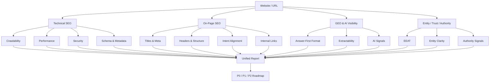

# SEO GEO Audit Skill

Unified website auditing for technical SEO, on-page quality, EEAT, GEO readiness, entity clarity, and authority signals.

This project is designed for teams that want one audit system instead of fragmented checklists, scattered tools, and disconnected reports.

It helps answer one core question:

> Is this site truly ready to win in both search engines and AI-driven discovery?

## Why This Project Exists

Most audit workflows stop too early.

They usually cover one of these layers well:

- technical SEO
- page optimization
- content quality
- trust and EEAT
- AI visibility

But growth decisions are rarely isolated to one layer.

A site can be:

- technically solid but not citable
- content-rich but structurally weak
- visible in search but weak in brand/entity recognition
- healthy on-page but missing trust and authority signals

This skill is built to evaluate the full stack of discoverability.

## What You Get

- one audit workflow
- one reporting structure
- one priority framework
- one roadmap that works for both SEO and GEO

It combines:

- technical health
- on-page quality
- content clarity
- trust and EEAT
- GEO and AI visibility
- entity and authority assessment

## Who This Is For

- founders who want a decision-ready growth diagnosis
- SEO operators who need a practical action plan
- consultants who want a reusable delivery framework
- growth teams optimizing for both rankings and AI visibility

## Core Audit Layers

### 1. Technical SEO

- crawlability and indexability
- performance and rendering
- redirects, canonicals, and URL hygiene
- HTTPS and security headers
- schema and metadata quality
- mobile and accessibility risks

### 2. On-Page SEO

- title and meta quality
- heading structure
- keyword and intent alignment
- content structure and depth
- internal linking
- image and media optimization

### 3. GEO and AI Visibility

- answer-first formatting
- semantic extractability
- quotability and citation-friendliness
- AI crawler signals
- machine-readable content structure

### 4. Entity, Trust, and Authority

- author and editorial transparency
- organization identity consistency
- about, contact, and policy coverage
- entity disambiguation
- third-party credibility indicators

## Audit Map



## Output Modes

### Boss Mode

Short, decision-ready summary with:

- current state
- business risks
- highest-impact opportunities
- clear next actions

### Operator Mode

Execution-focused report with:

- observed issues
- strategic assessments
- P0 / P1 / P2 roadmap
- validation gaps

### Specialist Mode

Full diagnostic report with:

- layered findings
- scoring logic
- assumptions
- data limitations

## Example Prompts

```text
Run a full SEO and GEO audit for https://example.com
```

```text
Audit this homepage in boss mode: https://example.com
```

```text
Give me an operator-style SEO GEO audit for https://example.com with P0, P1, and P2 actions
```

```text
Review this site for AI visibility, EEAT, and entity clarity: https://example.com
```

## Example Output

### Boss Mode Example

```text
One-line conclusion
The site has a strong SEO foundation, but homepage performance, security posture, and weak AI-ready trust signals are limiting growth efficiency.

Overall view
- Technical health: Medium
- Content and brand visibility: Medium
- AI / GEO readiness: Medium

Key issues
- Homepage is too heavy: slower rendering reduces ranking efficiency and conversion performance.
- Security headers are incomplete: trust and risk posture are weaker than they should be.
- Social metadata is missing: link sharing quality and CTR are being suppressed.
- Entity and trust signals are underdeveloped: the brand is harder for search engines and AI systems to confidently recognize and cite.

Priority
P0
- Reduce page weight, DOM size, and inline script/style payload.
- Add core security headers and enforce a stronger trust baseline.

P1
- Improve metadata, social cards, and mobile readability.
- Strengthen author, editorial, and organizational trust signals.

P2
- Expand to a broader site audit and connect external data sources for validation.
```

### Operator Mode Example

```text
Executive Summary
- Scope: Homepage audit
- Technical Health: 82-90 range with clear weaknesses in performance and security
- Strategic Visibility: Moderate
- Main conclusion: The site is indexable and structurally usable, but growth efficiency is being constrained by page weight, trust gaps, and incomplete AI-facing signals.

Technical SEO Findings
Observed
- Large HTML payload
- Heavy inline JavaScript and CSS
- Missing critical security headers
- Broken internal link detected

Assessment
- Technical debt is not catastrophic, but it is concentrated on high-visibility surfaces and will suppress both ranking efficiency and conversion performance.

On-Page and Content Findings
Observed
- Multiple H1 tags
- Weak social metadata coverage
- Mobile readability issues

Assessment
- The page communicates value, but the information hierarchy is not yet optimized for search clarity or fast comprehension.

GEO and AI Visibility Findings
Observed
- No llms.txt
- Limited machine-readable visibility signals

Assessment
- The site is not yet packaged as a strong AI-citable source, even if the product positioning is promising.

Entity and Authority Findings
Observed
- Limited public trust and identity reinforcement on-page

Assessment
- The brand signal exists, but it is not strong enough yet for confident entity recognition or authority transfer.

Priority Roadmap
P0
- Fix rendering weight and security baseline
- Remove structural blockers on primary pages

P1
- Strengthen metadata, trust elements, and AI-facing clarity

P2
- Extend the audit to templates, supporting pages, and off-page validation
```

## Recommended Workflow


## Repo Structure

```text
seo-geo-audit-skill/
├── SKILL.md
├── agents/
│   └── openai.yaml
└── references/
    ├── output-template.md
    ├── output-template-zh-boss.md
    └── scoring-framework.md
```

## Included References

- `SKILL.md`: workflow and triggering logic
- `references/scoring-framework.md`: scoring and prioritization model
- `references/output-template.md`: operator and specialist report template
- `references/output-template-zh-boss.md`: Chinese management summary template

## Recommended Use Cases

Use this project when you need:

- a homepage diagnosis before a launch
- an executive SEO + GEO summary for leadership
- a reusable client audit structure
- a practical roadmap for technical, content, and brand visibility work

## License

MIT
